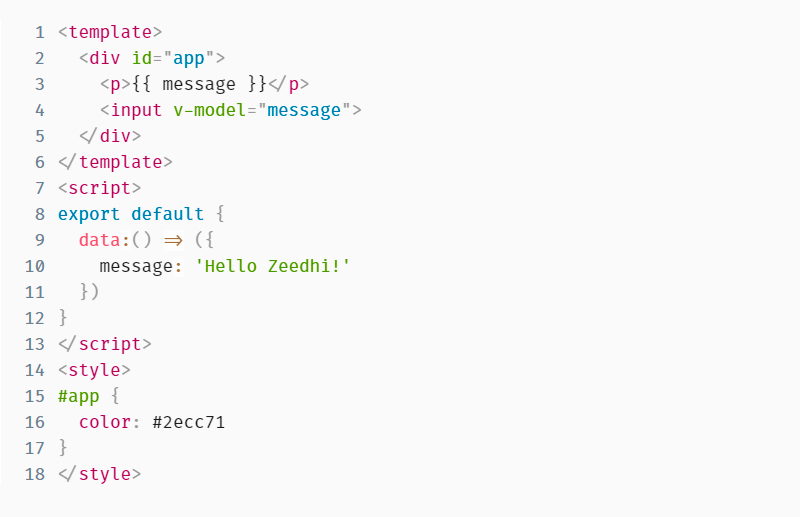

# Componente Highlight para Zeedhi

<p align="center">
  <a href="#instalação">Instalação</a>&nbsp;&nbsp;&nbsp;|&nbsp;&nbsp;&nbsp;
  <a href="#uso-básico">Uso Básico</a>&nbsp;&nbsp;&nbsp;|&nbsp;&nbsp;&nbsp;
  <a href="#propriedades">Propriedades</a>&nbsp;&nbsp;&nbsp;|&nbsp;&nbsp;&nbsp;
</p>

<p> O component zd-highlight é usado para mostrar o código usando uma das linguagens suportadas pelo Prism Js</p>

<p align="center">
  
</p>

## Instalação

Para instalar o pacote basta rodar o seguinte comando:\
`npm i zd-highlight`\
Com isso, dois pacotes serão instalados: o zd-highlight-common e o zd-highlight-vue.\
Após a instalação, é necessário que você você importe o pacote zd-highlight-vue dentro de seu arquivo de configuração `zeedhi.ts`

```
import { Highlight } from 'zd-highlight-vue';

Vue.component('ZdHighlight', Highlight);
```

Já o pacote zd-highlight-common deve ser importado no arquivo controller do componente.

## Uso Básico

Para usar, defina a propriedade component como 'ZdHighlight'.

```
{
  "name": "highlight-example",
  "component": "ZdHighlight"
}
```

## Propriedades

<table>
  <thead>
    <tr>
      <th>Nome</th>
      <th>Tipo</th>
      <th>Default</th>
      <th>Descrição</th>
    </tr>
  </thead>
  <tbody>
    <tr>
      <td>code</td>
      <td>string</td>
      <td>''</td>
      <td>Define o código inicial</td>
    </tr>
    <tr>
      <td>readonly</td>
      <td>boolean</td>
      <td>false</td>
      <td>Define se o código é somente leitura</td>
    </tr>
    <tr>
      <td>maxHeight</td>
      <td>string</td>
      <td>none</td>
      <td>Define a altura máxima que o textarea vai ter</td>
    </tr>
    <tr>
      <td>cssClass/td>
      <td>string</td>
      <td></td>
      <td>Define uma class no component</td>
    </tr>
    <tr>
      <td>cssStyle</td>
      <td>string | object</td>
      <td></td>
      <td>Define um style in line no component</td>
    </tr>
    <tr>
      <td>lineNumbers</td>
      <td>boolean</td>
      <td>false</td>
      <td>Define se deve mostra o número das linhas</td>
    </tr>
    <tr>
      <td>autoStyleLineNumbers</td>
      <td>boolean</td>
      <td>true</td>
      <td></td>
    </tr>
    <tr>
      <td>tabSize</td>
      <td>number|string</td>
      <td>2</td>
      <td>Define o número de caracteres a serem inseridos ao pressionar a tecla tab.</td>
    </tr>
    <tr>
      <td>insertSpaces</td>
      <td>boolean</td>
      <td>true</td>
      <td>Define se deve usar espaços para indentação</td>
    </tr>
    <tr>
      <td>ignoreTabKey</td>
      <td>boolean</td>
      <td>false</td>
      <td>Se o editor deve ignorar os pressionamentos de tecla de tabulação para que os usuários do teclado possam passar pelo editor</td>
    </tr>
    <tr>
      <td>language</td>
      <td>string</td>
      <td>ts</td>
      <td>Código de idioma a ser usado pelo highlight:
          - typescript, ts
          - javascript, js
          - html
          - css
          - json
          - bash, shell
          Mais detalhes em <a href="https://rocketseat.com.br/" target="_black" >Prism JS</a>
      </td>
    </tr>
  </tbody>
</table>

Este componente foi desenvolvido com ❤️ por **[@John Everton](https://www.linkedin.com/in/john-everton01/)**. <br>
Se isso te ajudou, dê uma ⭐, isso vai me ajudar também! 😉

<hr>

<div align="center">

[](https://www.linkedin.com/in/john-everton01/)

</div>
